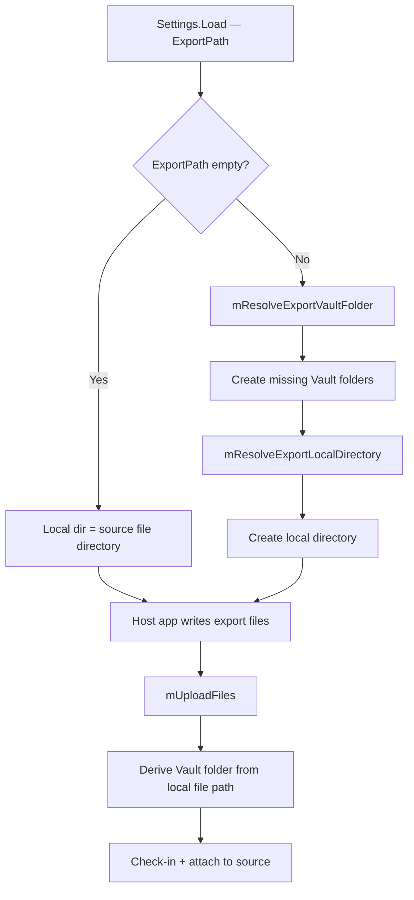

# Autodesk Vault Job Collection — Documentation

## Overview

The **Autodesk Vault Job Collection** is a set of custom Vault Job Processor extensions that automate export, translation, and item-management tasks for files managed in Autodesk Vault.  
Each project compiles to a single assembly that is registered with the Vault Job Processor through a `.vcet.config` file.  
The shared library `adsk.ts.job.shared` is **not a job** — it is a common infrastructure library consumed by all jobs.

---

## Solution Structure

| Project | Job Type ID | Application | Output / Format(s) |
|---|---|---|---|
| `adsk.ts.AssignUpdateFmItem` | `adsk.ts.assignupdateitem` | Vault API / Fusion Manage | Vault Item/BOM assignment, Upload to Fusion Manage |
| `adsk.ts.acad.dwg2d.create.inventor` | `adsk.ts.acad.dwg2d.create.inventor` | Autodesk Inventor / VaultInventorServer | DWG (2D) |
| `adsk.ts.export3d.create.inventor` | `adsk.ts.export3d.create.inventor` | Autodesk Inventor / VaultInventorServer | 3DDWG, STP, JT *(extensible)* |
| `adsk.ts.nwd.create.navisworks` | `adsk.ts.nwd.create.navisworks` | Autodesk Navisworks Manage | NWD, DWF |
| `adsk.ts.rvt.create.inventor` | `adsk.ts.rvt.create.inventor` | Autodesk Inventor / VaultInventorServer | RVT |
| `adsk.ts.pdf.create.slddrw` | `adsk.ts.pdf.create.slddrw` | Autodesk SolidWorks | PDF, DXF |
| `adsk.ts.pdf.create.office` | `adsk.ts.pdf.create.office` | LibreOffice *(default)* / Microsoft Office | PDF |
| `adsk.ts.image.create.inventor` | `adsk.ts.image.create.inventor` | Autodesk Inventor / VaultInventorServer | BMP, PNG, GIF, JPG, TIFF |
| `adsk.ts.job.shared` | *(shared library)* | — | — |

---

## Shared Library — `adsk.ts.job.shared`

This project is a **common infrastructure library**, not a job. It is referenced by every export job and provides:

### `JobCommon` class

#### `mDownloadFile(mFile, checkout?)`
Downloads a file from Vault to the local working folder, including all children and library references, using the release-biased version-gathering option. If a checkout is requested the file is simultaneously checked out. If the download is cancelled because the file already exists locally, the method verifies that the locally cached version is the latest consumable state before returning its path.

#### `mUploadFiles(mFile, filesToUpload, outPutPath?, copySourceComment?)`
Uploads a list of local files back into Vault. For each file it:
1. Optionally copies the file to a local output folder (if `OutputPath` is configured).
2. Determines the target Vault folder from the export file's local path (via the working-folder mapping established during download). When `ExportPath` is empty, export files sit next to the source file locally and are uploaded to the source file's Vault folder — the existing default behaviour.
3. Adds the file as a new Vault file if it does not yet exist, or checks it out and checks it back in as a new version if it does.
   - `.dwf` files are uploaded as `DesignVisualization` (hidden); all other files are uploaded as `DesignRepresentation`.
4. Synchronises the revision label of the export file to match the source file's revision label.
5. Synchronises all user-defined properties (UDPs) that are assigned to both the source file's category and the export file's category.
6. Sets the system comment on the export file — see **CopySystemComment logic** below.
7. For `DesignVisualization` files: synchronises the lifecycle state name from the source file.
8. Attaches the export file to its source file using the appropriate attachment type (`DesignRepresentation` or `DesignVisualization`). Any pre-existing attachment with the same master ID is replaced.

#### Export path helpers

Shared helpers on `JobCommon` resolve the `ExportPath` setting and prepare the local export directory before any host application (Inventor, Navisworks, SolidWorks) runs:

| Helper | Purpose |
|---|---|
| `mResolveExportVaultFolder(exportPath, sourceFile)` | Resolves the configured path to a Vault folder path. Creates the folder (and any missing parent folders) in Vault when it does not yet exist. |
| `mResolveExportLocalDirectory(exportPath, sourceFile)` | Maps the resolved Vault folder to a local working-folder path. Creates the local directory on the Job Processor machine if needed. Returns the directory where export files must be written. |

See [Export Path Configuration (`ExportPath`)](#export-path-configuration-exportpath) for resolution rules and examples.

#### `mGetSourceComment(mFile)` *(private)*
Resolves the source file's system comment that will be written to the export file when `CopySystemComment = True`.

**Logic:**

| Situation | Comment used |
|---|---|
| Source file is **not in a consumable lifecycle state** (`FileLfCyc.Consume == false`) | `mFile.Comm` — the current iteration's own comment |
| Source file **is in a consumable state** (`FileLfCyc.Consume == true`) | The comment of the **first iteration** that entered the current revision × lifecycle-state combination |
| First-in-state comment is empty, or any error occurs | Falls back to `mFile.Comm`, or to `"Created by ExportSampleJob"` if that is also empty |

**Why the distinction matters:**  
When Vault transitions a file into a consumable state (e.g. "Released"), it immediately creates a new iteration tagged *"Property Update"* to propagate properties to attached export files. If the job is triggered by that property-update iteration, `mFile.Comm` would be `"Property Update"` rather than the engineer's original release comment. The helper detects this situation by checking `FileLfCyc.Consume`. When the flag is `true` it queries all iterations of the master (`GetFilesByMasterId`), filters to those sharing the same **lifecycle state ID** and the same **revision** (`FileRev.MaxFileId`), and picks the one with the lowest database ID — i.e. the first iteration that caused the state transition — which still carries the original comment.

### `InventorJob` class (`adsk.ts.job.inventor.cs`)
Provides helpers for Inventor project-file (`.ipj`) management:
- `mGetIpj(acceptLocalIpj)` — downloads and activates the Vault-configured Inventor project file.
- `mResetIpj(savedProject)` — restores the previously active project after the job completes.

---

## Job: Assign / Update Fusion Manage Item

**Project:** `adsk.ts.AssignUpdateFmItem`  
**Job type:** `adsk.ts.assignupdateitem`  
**Triggered on:** any Vault file lifecycle or property event

### What it does
Assigns or updates a Fusion Manage (Fusion Operations) item for the triggering Vault file.

1. The job skips non-file entities and files in the categories `Reference`, `Phantom`, and `Substitute`, and files classified as `DesignVisualization`, `DesignRepresentation`, or `ConfigurationFactory`.
2. For files classified as `DesignDocument` the job locates the primary parent file (via dependency associations) and promotes that file instead.
3. It calls `ItemService.AddFilesToPromote` with `ItemAssignAll = Yes`, executes `PromoteComponentOrder` for primary and non-primary components, then commits all unlocked items with `UpdateAndCommitItems`.
4. If `FMSync = True` and an `ExternalSyncService` is available, the job submits an `Adsk.UploadItem` task to Fusion Manage for each created or updated item.

### Settings — `adsk.ts.assignupdateitem.xml`

| Setting | Type | Description |
|---|---|---|
| `LogFileLocation` | Path | Directory where the job writes its log file. Must be writable by the Job Processor service account. |
| `FMSync` | `True` / `False` | When `True`, submits an external sync task to Fusion Manage after each successful item update. Requires a valid Fusion Manage connector configuration named `Adsk.Vault.ExternalSyncTask.FusionManage` to be present in the Vault server. |

---

## Job: 2D DWG Export from Inventor

**Project:** `adsk.ts.acad.dwg2d.create.inventor`  
**Job type:** `adsk.ts.acad.dwg2d.create.inventor`  
**Application:** Autodesk Inventor / VaultInventorServer  
**Triggered on:** Vault file lifecycle event for Inventor 2D drawings

### What it does
Opens an Inventor 2D drawing (`.idw` or `.dwg`) in VaultInventorServer and exports it to AutoCAD DWG format using the built-in DXF/DWG translator add-in (`{C24E3AC2-122E-11D5-8E91-0010B541CD80}`). The DWG translator reads its export options from a configurable `.ini` file. The resulting file is named `<source-file>.<original-ext>.dwg` (e.g. `Drawing1.idw.dwg`).

**Execution filters (hard-coded):**
- Only `.idw` and `.dwg` source files are processed.
- Files classified as `DesignRepresentation` are skipped silently.

### Settings — `adsk.ts.acad.dwg2d.create.inventor.settings.xml`

| Setting | Type | Description |
|---|---|---|
| `LogFileLocation` | Path | Directory where the job writes its log file. |
| `AcceptLocalIpj` | `True` / `False` | When `True`, the job tolerates a failed Vault IPJ download and reuses the last locally cached project file. Set to `False` to enforce a fresh download on every run. |
| `EnforceSubmittedFileVersion` | `True` / `False` | When `True`, the job aborts if the submitted file version is no longer the latest version of the revision (e.g. because a subsequent property-update iteration was created before the job ran). Set to `False` (recommended when a property-sync job runs in the same lifecycle transition) to always process the tip version. |
| `ExportFormats` | `2DDWG` | Currently only `2DDWG` is supported. Reserved for future additional formats. |
| `DwgIniFile2D` | Path | Full local path to the Inventor DWG export configuration `.ini` file. This file controls layer mappings, DWG version, and all other translator-specific options. The file must be present on the Job Processor machine. |
| `CopySystemComment` | `True` / `False` | See [CopySystemComment logic](#copysystemcomment-logic) below. |
| `ExportPath` | Vault path | Optional export destination. Leave empty to export next to the source file (current default). See [Export Path Configuration](#export-path-configuration-exportpath). |
| `OutputPath` | Path | Optional local folder to which the exported file is also copied after Vault check-in. Leave empty to disable the copy. |

---

## Job: 3D Export from Inventor

**Project:** `adsk.ts.export3d.create.inventor`  
**Job type:** `adsk.ts.export3d.create.inventor`  
**Application:** Autodesk Inventor / VaultInventorServer  
**Triggered on:** Vault file lifecycle event for Inventor 3D files

### What it does
Opens an Inventor part (`.ipt`) or assembly (`.iam`) in VaultInventorServer and exports it to one or more 3D neutral formats. Multiple formats can be listed in `ExportFormats`, and the job iterates over each one in sequence within a single job execution.

**Currently implemented translators:**

| Format token | Extension | Translator add-in GUID | Notes |
|---|---|---|---|
| `3DDWG` | `.dwg` | `{C24E3AC2-122E-11D5-8E91-0010B541CD80}` | 3D DWG with solids; DWG version R2013 (code 32) |
| `STEP` / `STP` | `.stp` | `{90AF7F40-0C01-11D5-8E83-0010B541CD80}` | AP214 Automotive Design protocol |
| `JT` | `.jt` | `{16625A0E-F58C-4488-A969-E7EC4F99CACD}` | JT version 10.2 (code 102) |

Additional formats that Inventor supports (but are not yet wired up): `CATPart`, `CATProduct`, `glTF`, `IGES`, `OBJ`, `X_B`, `X_T`, `ProE_G`, `ProE_N`, `QIF`, `SAT`, `SMT`, `STL`, `USDz`.

**Execution filters (hard-coded):**
- Only `.ipt` and `.iam` source files are processed.
- Files classified as `ConfigurationFactory` or `DesignDocumentation` are always skipped.
- Format–file-type compatibility: `CATPart` and `QIF` are IPT-only; `CATProduct` is IAM-only.

### Settings — `adsk.ts.export3d.create.inventor.settings.xml`

| Setting | Type | Description |
|---|---|---|
| `LogFileLocation` | Path | Directory where the job writes its log file. |
| `AcceptLocalIpj` | `True` / `False` | Same as the 2D DWG job — see above. |
| `EnforceSubmittedFileVersion` | `True` / `False` | Same as the 2D DWG job — see above. |
| `ExportFormats` | Comma-separated list | One or more format tokens from `3DDWG`, `STP`, `JT`. Example: `STP, JT`. Each token generates a separate output file. |
| `ExcludeDesignSubstitute` | `True` / `False` | When `False` (default), files classified as `DesignSubstitute` are also exported. Set to `True` to skip them. |
| `CopySystemComment` | `True` / `False` | See [CopySystemComment logic](#copysystemcomment-logic) below. |
| `ExportPath` | Vault path | Optional export destination. See [Export Path Configuration](#export-path-configuration-exportpath). |
| `OutputPath` | Path | Optional local folder for post-upload file copy. |

---

## Job: Navisworks NWD Export

**Project:** `adsk.ts.nwd.create.navisworks`  
**Job type:** `adsk.ts.nwd.create.navisworks`  
**Application:** Autodesk Navisworks Manage (COM automation)  
**Triggered on:** Vault file lifecycle event

### What it does
Launches a Navisworks Manage automation instance, opens the source file (or appends it to a downloaded NWD template), and saves the result as an NWD file. Optionally it also exports a DWF alongside the NWD. A Navisworks cache file (`.nwc`) that Navisworks may auto-create during import is detected and added to the upload list as well.

**Execution filters (hard-coded):**
- Files classified as `ConfigurationFactory` or `DesignDocumentation` are skipped.
- The Navisworks automation instance is verified before any Vault download begins; the job fails fast if Navisworks is not available.

**Output files:**

| Format token | Files created |
|---|---|
| `NWD` | `<source>.<ext>.nwd` + optionally `<source>.<ext>.nwc` |
| `NWD+DWF` | `<source>.<ext>.nwd` + `<source>.<ext>.dwf` + optionally `<source>.<ext>.nwc` |

NWC files, when present, are uploaded as additional `DesignRepresentation` attachments.

### Settings — `adsk.ts.nwd.create.navisworks.settings.xml`

| Setting | Type | Description |
|---|---|---|
| `LogFileLocation` | Path | Directory where the job writes its log file. |
| `EnforceSubmittedFileVersion` | `True` / `False` | Same as the 2D DWG job — see above. |
| `ExportFormats` | `NWD` or `NWD+DWF` | `NWD` creates only the NWD file. `NWD+DWF` additionally exports a DWF via the Navisworks `LcDwfExporterPlugin`. |
| `NwdTemplate` | Vault path | Vault path to an NWD file to use as a base template (e.g. `$/Templates/Navisworks/Standard-Vertical-Z.nwd`). When set, Navisworks opens the template first and then appends the source file. Leave empty to open the source file directly. **Note:** using a template adds an additional Vault reference to the resulting NWD file. |
| `CopySystemComment` | `True` / `False` | See [CopySystemComment logic](#copysystemcomment-logic) below. |
| `ExportPath` | Vault path | Optional export destination. See [Export Path Configuration](#export-path-configuration-exportpath). |
| `OutputPath` | Path | Optional local folder for post-upload file copy. |

---

## Job: Revit Simplification Export from Inventor

**Project:** `adsk.ts.rvt.create.inventor`  
**Job type:** `adsk.ts.rvt.create.inventor`  
**Application:** Autodesk Inventor / VaultInventorServer  
**Triggered on:** Vault file lifecycle event for Inventor assemblies

### What it does
Creates a simplified Revit (`.rvt`) file from an Inventor assembly using the Inventor Revit Simplification feature (`RevitExports`). The job supports multiple target Revit versions and multiple simplification presets per run, producing one output file per version × preset combination.

**Key steps:**
1. Validates that all configured Revit versions are installed on the Job Processor machine via `GetRevitEngineInstallationStatus()`.
2. Downloads the simplification preset file from Vault and reads the preset map.
3. Optionally downloads a Revit template (`.rte`) from Vault — once, reused for all version × preset iterations.
4. Downloads the source `.iam` file including all references.
5. Opens the assembly in Inventor (VaultInventorServer or full Inventor.exe, depending on `UseInventorExe`).
6. For each configured **Revit version** × each configured **preset name**:
   - Looks up or creates a `RevitExportDefinition` on the assembly.
   - Sets `revitExportDef.RevitVersion` to the current version.
   - Applies all simplification settings from the selected preset (envelope style, part/hole/fillet/chamfer/pocket/emboss/tunnel removal thresholds, structure type, internal-void and internal-part removal, colour override).
   - Assigns the downloaded Revit template to the export definition.
   - Runs the export via `RevitExports.Add()` (new) or `revitExport.Update()` (existing).
   - When multiple versions or presets are configured, output files are named `<source>.iam_<version>_<preset>.rvt`; in single-combination mode the simpler `<source>.iam.rvt` name is used.
7. Saves the assembly document once after all iterations (if associative mode is enabled and the file was checked out).
8. Closes the Inventor document once after all iterations.
9. Shuts down the Revit translator add-in (`mShutdownRvtTranslator`) to release the out-of-process Revit engine.
10. Checks in the source assembly to Vault if it was checked out (used when associative export updating is enabled).
11. Uploads all generated `.rvt` files via the shared `mUploadFiles`.

**Execution filters (hard-coded):**
- Only `.iam` (Inventor assembly) source files are processed.
- Files classified as `ConfigurationFactory` are skipped.

### Settings — `adsk.ts.rvt.create.inventor.settings.xml`

| Setting | Type | Description |
|---|---|---|
| `LogFileLocation` | Path | Directory where the job writes its log file. |
| `AcceptLocalIpj` | `True` / `False` | Same as the 2D DWG job — see above. |
| `EnforceSubmittedFileVersion` | `True` / `False` | Same as the 2D DWG job — see above. |
| `UseInventorExe` | `True` / `False` | When `False` (default), the job runs inside VaultInventorServer (no seat required). When `True`, the job launches a full Inventor.exe instance. Use `True` only when specific functionality is not available in VaultInventorServer. |
| `ExportFormats` | `RVT` | Currently only `RVT` is supported. Reserved for future formats. |
| `RvtAssociative` | `True` / `False` | When `True`, the Revit export feature is created with `EnableUpdating = true` and the assembly is checked out and checked back in so Vault stores the associative link. When `False` (default), a non-associative snapshot export is performed and no check-out is needed. |
| `TargetRevitVersion` | Comma-separated year(s) | One or more target Revit version years, e.g. `2027` or `2026, 2027`. Each version must be installed on the Job Processor machine. The job validates availability before starting any export. Multiple values produce one output file per version per preset. |
| `RevitTemplate` | Vault path | Vault path to a Revit template file (`.rte`), e.g. `$/Templates/Revit/RevitExportTemplate.rte`. Leave empty to use Inventor's built-in default template. The template is downloaded once and reused for all version × preset iterations. **Note:** ensure the template's Revit version is ≤ the minimum configured target version. |
| `InventorPreset` | Vault path | Vault path to the Inventor simplification preset file (`.preset`), e.g. `$/Templates/Inventor/Presets/SimplifyCmd.preset`. This file contains the named simplification configurations. |
| `InventorPresetName` | Comma-separated name(s) | One or more preset names defined inside the preset file, e.g. `RVT_Level_2` or `RVT_Level_1, RVT_Level_2`. All named `Preset` nodes in the preset file are loaded, so any custom preset name is supported alongside the built-in ones. Multiple values produce one output file per preset per Revit version. |
| `CopySystemComment` | `True` / `False` | See [CopySystemComment logic](#copysystemcomment-logic) below. |
| `ExportPath` | Vault path | Optional export destination. See [Export Path Configuration](#export-path-configuration-exportpath). |
| `OutputPath` | Path | Optional local folder for post-upload file copy. |

---

## Job: PDF Export from SolidWorks Drawing

**Project:** `adsk.ts.pdf.create.slddrw`  
**Job type:** `adsk.ts.pdf.create.slddrw`  
**Application:** Autodesk SolidWorks (COM automation)  
**Triggered on:** Vault file lifecycle event for SolidWorks drawings

### What it does
Launches SolidWorks via COM automation, opens a SolidWorks drawing (`.slddrw`) and exports it to PDF. A named DXF sheet can be handled separately: excluded from the PDF and exported as a standalone DXF file instead.

**Sheet handling:**
- All sheets except the designated DXF sheet (if configured and exclusion is enabled) are collected into the PDF.
- If the DXF sheet exclusion is active and the named sheet exists, SolidWorks exports that sheet as a separate `.dxf` file which is then uploaded to Vault alongside the PDF.

**Output filenames** depend on `IncludeSourceFileExtension`:
- `True`: `drawing.slddrw.pdf` / `drawing.slddrw.dxf`
- `False`: `drawing.pdf` / `drawing.dxf`

**Execution filters (hard-coded):**
- Only `.slddrw` source files are processed.

### Settings — `adsk.ts.pdf.create.slddrw.settings.xml`

| Setting | Type | Description |
|---|---|---|
| `LogFileLocation` | Path | Directory where the job writes its log file. |
| `EnforceSubmittedFileVersion` | `True` / `False` | Same as the 2D DWG job — see above. |
| `ExportFormats` | `SLDDRW.PDF` | Currently only `SLDDRW.PDF` is supported. |
| `IncludeSourceFileExtension` | `True` / `False` | Controls whether the source file extension is included in the output filename. `True` (default): `drawing.slddrw.pdf`. `False`: `drawing.pdf`. |
| `DxfSheetName` | String | Name of the drawing sheet that represents DXF content (e.g. `DXF`). Used in conjunction with `PdfIncludeDxfSheet`. |
| `PdfIncludeDxfSheet` | `True` / `False` | When `False`, the sheet named by `DxfSheetName` is excluded from the PDF export and is instead saved as a separate `.dxf` file. When `True`, all sheets including the DXF sheet are included in the PDF and no separate DXF is created. |
| `CopySystemComment` | `True` / `False` | See [CopySystemComment logic](#copysystemcomment-logic) below. |
| `ExportPath` | Vault path | Optional export destination. See [Export Path Configuration](#export-path-configuration-exportpath). |
| `OutputPath` | Path | Optional local folder for post-upload file copy. |

---

## Job: PDF Export from Microsoft Office

**Project:** `adsk.ts.pdf.create.office`  
**Job type:** `adsk.ts.pdf.create.office`  
**Application:** LibreOffice headless *(default)* or Microsoft Office desktop *(COM Interop)*  
**Triggered on:** Vault file lifecycle event for Microsoft Office documents

### What it does
Downloads a Microsoft Office Open XML file (`.docx`, `.xlsx`, or `.pptx`) from Vault and converts it to PDF using the configured conversion engine. The resulting PDF is uploaded to Vault as a `DesignRepresentation` attachment on the source file.

**Conversion engines:**

| Engine setting | Requirement | Notes |
|---|---|---|
| `LibreOffice` *(default)* | [LibreOffice](https://www.libreoffice.org/) installed on the Job Processor | License-free (MPL 2.0). Uses headless `soffice.exe`. |
| `MicrosoftOffice` | Licensed Word, Excel, and PowerPoint desktop installed | Highest fidelity. Microsoft does not support unattended server-side Office automation — use only when you accept that deployment model. |

**Output filenames** depend on `IncludeSourceFileExtension`:
- `True`: `report.docx.pdf`
- `False`: `report.pdf`

**Execution filters (hard-coded):**
- Only `.docx`, `.xlsx`, and `.pptx` source files are processed.
- Password-protected Office Open XML files are rejected before conversion begins.
- The conversion engine is validated before download when `ValidateEngineOnStartup = True`.
- Only one Office/LibreOffice conversion runs at a time on the Job Processor machine.

**Suggested Vault job rule:**

```
Job type: adsk.ts.pdf.create.office
Condition: File extension is .docx OR .xlsx OR .pptx
           AND lifecycle state = Released
```

### Settings — `adsk.ts.pdf.create.office.settings.xml`

| Setting | Type | Description |
|---|---|---|
| `LogFileLocation` | Path | Directory where the job writes its log file. |
| `EnforceSubmittedFileVersion` | `True` / `False` | Same as the 2D DWG job — see above. |
| `ExportFormats` | `OFFICE.PDF` | Currently only `OFFICE.PDF` is supported. |
| `IncludeSourceFileExtension` | `True` / `False` | Controls whether the source file extension is included in the output filename. `True` (default): `report.docx.pdf`. `False`: `report.pdf`. |
| `CopySystemComment` | `True` / `False` | See [CopySystemComment logic](#copysystemcomment-logic) below. |
| `ExportPath` | Vault path | Optional export destination. See [Export Path Configuration](#export-path-configuration-exportpath). |
| `OutputPath` | Path | Optional local folder for post-upload file copy. |
| `ConversionEngine` | `LibreOffice` / `MicrosoftOffice` | Selects the PDF conversion backend. Default: `LibreOffice`. |
| `LibreOfficePath` | Path | Full path to `soffice.exe`. Leave empty to auto-detect the default install location. |
| `LibreOfficeProfileRoot` | Path | Base directory for isolated LibreOffice user profiles created per conversion. Leave empty for the default under `%ProgramData%`. |
| `ConversionTimeoutSeconds` | Integer | Maximum seconds to wait for a LibreOffice conversion. Default: `180`. |
| `ValidateEngineOnStartup` | `True` / `False` | When `True`, validates the configured engine before downloading the source file. |
| `OfficeVisible` | `True` / `False` | Microsoft Office engine only. Shows Word/Excel/PowerPoint during conversion. Default: `False`. |
| `PdfExportQuality` | `Standard` / `Minimum` | Microsoft Office engine only. Controls Word/Excel PDF export quality. Default: `Standard`. |

### Deployment prerequisites

| Engine | Job Processor requirements |
|---|---|
| **LibreOffice** | LibreOffice 7.x or later; writable profile temp directory; recommended: install common fonts used in source documents |
| **Microsoft Office** | Licensed Word, Excel, and PowerPoint desktop; COM accessible to the Job Processor service account; may require an interactive desktop session |

---

## Job: Image Export from Inventor

**Project:** `adsk.ts.image.create.inventor`  
**Job type:** `adsk.ts.image.create.inventor`  
**Application:** Autodesk Inventor / VaultInventorServer  
**Triggered on:** Vault file lifecycle event for Inventor files

### What it does
Opens an Inventor file in VaultInventorServer and renders a static image using a programmatically created camera. The camera is oriented to `IsoTopRight` for parts and assemblies, or aimed at the active sheet for drawings. The scene is fitted to fill the frame before capture. The output is a `1280 × 768` px image with a white-to-light-grey gradient background.

**Document-type handling:**
- `.ipt` (Part): camera on `ComponentDefinition`, IsoTopRight orientation.
- `.iam` (Assembly): camera on `ComponentDefinition`, IsoTopRight orientation.
- `.idw` / `.dwg` (Drawing): camera on the active `Sheet`.

**Execution filters (hard-coded):**
- Only `.ipt`, `.iam`, `.dwg`, and `.idw` source files are processed.
- Files classified as `DesignRepresentation` are skipped.

### Settings — `adsk.ts.image.create.inventor.settings.xml`

| Setting | Type | Description |
|---|---|---|
| `LogFileLocation` | Path | Directory where the job writes its log file. |
| `AcceptLocalIpj` | `True` / `False` | Same as the 2D DWG job — see above. |
| `EnforceSubmittedFileVersion` | `True` / `False` | Same as the 2D DWG job — see above. |
| `ExportFormats` | `IMAGE` | Currently only `IMAGE` is supported. The image file type is controlled separately by `ImgFileType`. |
| `ImgFileType` | `BMP` / `PNG` / `GIF` / `JPG` / `TIFF` | File format for the rendered image. Passed directly to `Camera.SaveAsBitmap`. Default: `PNG`. |
| `CopySystemComment` | `True` / `False` | See [CopySystemComment logic](#copysystemcomment-logic) below. |
| `ExportPath` | Vault path | Optional export destination. See [Export Path Configuration](#export-path-configuration-exportpath). |
| `OutputPath` | Path | Optional local folder for post-upload file copy. |

---

## Export Path Configuration (`ExportPath`)

All export jobs share an optional `ExportPath` setting that controls **where export files are created locally** on the Job Processor machine. Because Vault downloads use `OrganizeFilesRelativeToCommonVaultRoot = true`, the local working-folder layout mirrors the Vault folder structure. Setting the correct local export directory therefore produces the expected Vault destination on upload — no separate Vault upload override is required.

### Design principles

| Principle | Detail |
|---|---|
| **Local path drives Vault path** | Jobs write export files to a resolved local directory. `mUploadFiles` derives the Vault upload folder from each file's local path via the working-folder mapping. |
| **Admin-configured, auto-create** | The Job Processor admin sets `ExportPath` in the job settings XML. If the target Vault folder does not exist, the job creates it (and any missing intermediate folders) before export begins. |
| **Backward compatible** | When `ExportPath` is empty, export files are written next to the downloaded source file and uploaded to the source file's Vault folder — identical to current behaviour. |
| **Distinct from `OutputPath`** | `ExportPath` controls the primary export location. `OutputPath` remains an optional *additional* local copy made after Vault check-in. |

### Setting values

| Value | Type | Example | Result for source `$/Designs/P-00020/CAD/Assy.iam` |
|---|---|---|---|
| *(empty)* | Default | — | Local: next to source download. Vault: `$/Designs/P-00020/CAD/` |
| Absolute Vault path | Starts with `$/` | `$/Designs/Revit Exports` | Vault: `$/Designs/Revit Exports/`. Local: mapped working-folder path. |
| Relative — upward | Starts with `..` | `..\Revit Export` or `..\..\Common Exports` | Resolved from source folder; each `..` moves up one Vault folder level, then any remaining segments descend. |
| Relative — downward | Does not start with `..` | `Revit Export` | Vault: `$/Designs/P-00020/CAD/Revit Export/` *(subfolder of source folder)* |

### Path resolution rules

1. **Empty or whitespace** → use the source file's Vault folder (current default).
2. **Absolute** (starts with `$/`) → use the path as-is after normalising separators to `/`.
3. **Relative** → resolve from the **source file's Vault folder** (`FindFoldersByIds` → `Folder.FullName`):
   - If the path **starts with `..`**, apply standard `..` and `.` segment navigation from the source folder. Each `..` moves up one parent folder; any folder names after the `..` segments descend from the resulting location. Examples from `$/Designs/P-00020/CAD`: `..\Revit Export` → `$/Designs/P-00020/Revit Export`; `..\..\Common Exports` → `$/Designs/Common Exports`.
   - If the path does **not** start with `..`, append it as a sub-path under the source folder. Example: `Revit Export` → `$/Designs/P-00020/CAD/Revit Export`. A leading `\` is stripped before appending.
   - Normalise duplicate slashes; trim trailing `/`.
4. **Folder creation** → walk the resolved Vault path segment by segment. Create any folder that does not exist using the Vault Document Service. Fail only if creation is denied by permissions.
5. **Local mapping** → map the resolved Vault folder to a local directory via `WorkingFoldersManager` (same root used by `mDownloadFile`). Create the local directory if it does not exist.

### Processing pipeline



### Examples

**Source file:** `$/Designs/P-00020/CAD/Assy.iam`

| `ExportPath` | Resolved Vault folder | Export file |
|---|---|---|
| *(empty)* | `$/Designs/P-00020/CAD` | `Assy.iam.rvt` |
| `$/Designs/Revit Exports` | `$/Designs/Revit Exports` | `Assy.iam.rvt` |
| `..\Revit Export` | `$/Designs/P-00020/Revit Export` | `Assy.iam.rvt` |
| `Revit Export` | `$/Designs/P-00020/CAD/Revit Export` | `Assy.iam.rvt` |
| `..\..\Common Exports` | `$/Designs/Common Exports` | `Assy.iam.rvt` |

**Source file:** `$/Designs/P-00020/CAD/Detail/Assy.iam`

| `ExportPath` | Resolved Vault folder |
|---|---|
| `Revit Export` | `$/Designs/P-00020/CAD/Detail/Revit Export` *(subfolder of source folder)* |
| `..\Revit Export` | `$/Designs/P-00020/CAD/Revit Export` *(one level up, then into `Revit Export`)* |
| `..\..\Revit Export` | `$/Designs/P-00020/Revit Export` *(two levels up, then into `Revit Export`)* |

### Per-job export file naming

Export **filenames** are unchanged; only the **directory** changes. Each job builds the full export path as `Path.Combine(exportLocalDir, <existing filename logic>)`:

| Job | Filename pattern (unchanged) |
|---|---|
| RVT | `<source>.iam.rvt` or `<source>.iam_<version>_<preset>.rvt` |
| 2D DWG | `<source>.dwg` |
| 3D | `<source>.dwg` / `.stp` / `.jt` |
| Navisworks | `<source>.nwd` / `.dwf` / `.nwc` |
| PDF (SolidWorks) | `<source>.pdf` / `.dxf` |
| PDF (Office) | `<source>.pdf` *(e.g. `report.docx.pdf` or `report.pdf`)* |
| Image | `<source>.<ImgFileType>` |

### Implementation scope

| Component | Change |
|---|---|
| `adsk.ts.job.shared` — `JobCommon` | Add `mResolveExportVaultFolder`, `mResolveExportLocalDirectory`, `mEnsureVaultFolderExists`; update `mUploadFiles` to derive upload folder from local export path |
| All 7 export jobs — `Settings.cs` | Add `[XmlElement("ExportPath")] public string ExportPath` |
| All 7 export jobs — `*.settings.xml` | Add `<ExportPath></ExportPath>` with inline comments |
| All 7 export jobs — `JobExtension.cs` | Resolve export directory after source download; write all export files there |
| RVT — `JobExtension.cs` | Set `revitExportDef.Location` to resolved local directory |

### XML configuration example

```xml
<!-- Export destination. Leave empty to export next to the source file. -->
<!-- Absolute:        $/Designs/Revit Exports -->
<!-- Relative up:     ..\Revit Export  or  ..\..\Common Exports  (.. = one level up per segment) -->
<!-- Relative down:   Revit Export  (subfolder under the source file's folder) -->
<ExportPath></ExportPath>
```

---

## Shared Behaviour — CopySystemComment Logic

`CopySystemComment` is available in all export jobs. It controls the value of the **system comment** (the `File.Comm` / *Comment* field) written to the export file when its properties are synchronised.

### `False` (default)
The system comment of the export file is always set to the hard-coded string `"Created by ExportSampleJob"`.

### `True`
The system comment is resolved dynamically from the **source file** by the shared `mGetSourceComment` helper:

```
Source file iteration
│
├── FileLfCyc.Consume == false  (not in a consumable state, e.g. "Work in Progress")
│     └── Use mFile.Comm directly
│           ├── Non-empty  →  Use that comment
│           └── Empty      →  Fall back to "Created by ExportSampleJob"
│
└── FileLfCyc.Consume == true   (in a consumable state, e.g. "Released")
	  │
	  ├── Query all iterations of this master (GetFilesByMasterId)
	  ├── Filter: same LfCycStateId AND same FileRev.MaxFileId (same revision)
	  ├── Order by Id ascending → first entry = iteration that caused the state transition
	  │
	  ├── firstInState.Comm non-empty  →  Use that comment
	  ├── firstInState.Comm empty      →  Fall back to mFile.Comm
	  └── mFile.Comm empty             →  Fall back to "Created by ExportSampleJob"
```

**Why this matters:**  
Whenever Vault transitions a file into a consumable lifecycle state (e.g. "Released"), it automatically creates an additional iteration whose comment is `"Property Update"` to push properties to all attached export files. If an export job is queued and runs on that property-update iteration, naïvely reading `mFile.Comm` would write `"Property Update"` into the export file's comment — obscuring the engineer's original release comment (e.g. `"Approved for production – ECO-4711"`).

By checking `FileLfCyc.Consume` first, the helper knows whether the file is in a consumable state. If it is, it looks backwards through the iteration history to find the first iteration that entered the current revision+state combination — which is the one carrying the meaningful release comment — and uses that instead.

---

## Common Settings Reference

The following settings appear in multiple jobs with identical meaning:

| Setting | Jobs | Description |
|---|---|---|
| `LogFileLocation` | All | Local directory for the per-job log file (`<job-type>_<filename>.log`). The Job Processor service account must have write access. |
| `EnforceSubmittedFileVersion` | All except `AssignUpdateFmItem` | When `True`, the job aborts if the submitted entity ID is no longer the tip version. Set to `False` when a property-sync job runs in the same lifecycle transition and may advance the version before the export job runs. |
| `AcceptLocalIpj` | Inventor-based jobs | When `True`, the job continues with a locally cached Inventor project file if the Vault download fails. |
| `ExportFormats` | All export jobs | Selects the output format(s). Multiple values are comma-separated where supported. |
| `CopySystemComment` | All export jobs | Controls whether the source file's comment is propagated to the export file. See the [CopySystemComment logic](#copysystemcomment-logic) section. |
| `ExportPath` | All export jobs | Optional Vault path (absolute or relative) for export file placement. Paths starting with `..` navigate upward from the source folder (multiple `..` segments supported); paths without a leading `..` resolve as subfolders of the source folder. Resolved to a local working-folder directory before export; uploaded to the matching Vault folder. Auto-creates missing Vault folders. See [Export Path Configuration](#export-path-configuration-exportpath). |
| `OutputPath` | All export jobs | When set, the job copies each exported file to this local path after uploading it to Vault. Independent of `ExportPath`. |
